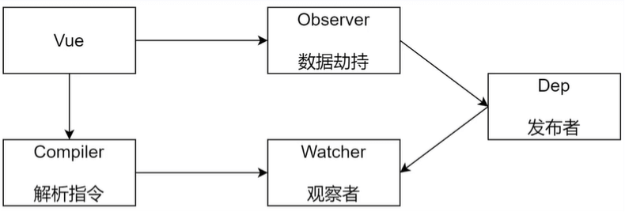
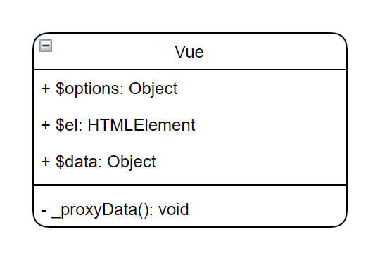
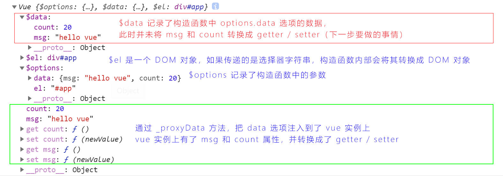
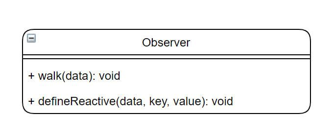
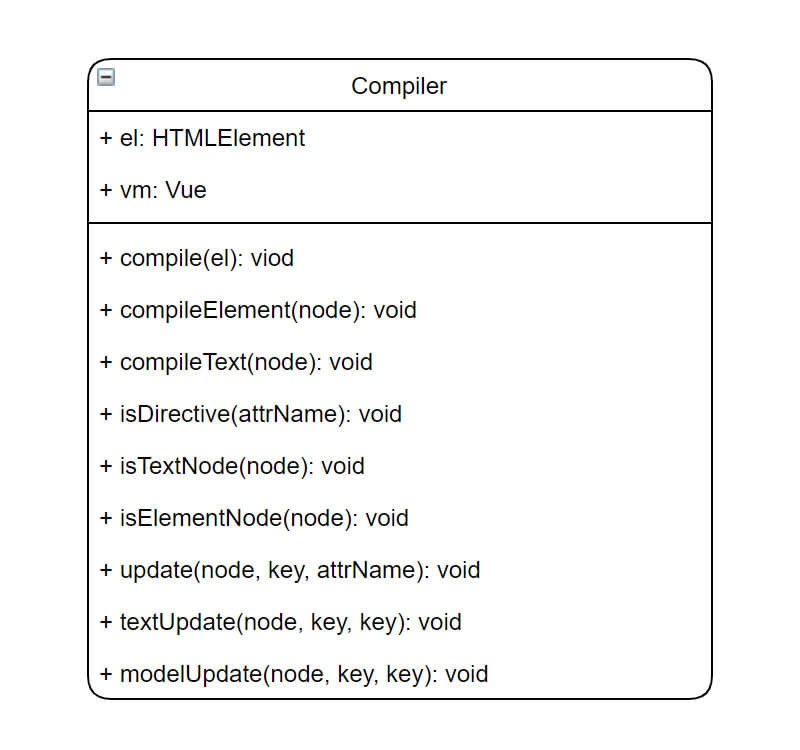
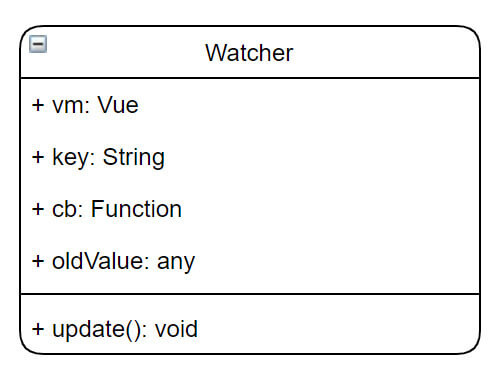

# 实现最小版本的 Vue

## 实现五种类型

+ Vue
  + 负责把 data 选项中的成员变成响应式（即：转换成 getter / setter 形式），并注入到 Vue 实例
  + 内部调用 Observer 和 Compiler
+ Compiler
  + 解析每个元素中的指令、插值表达式，并替换成相应的数据
+ Obserer
  + 数据劫持
  + 对 data 中的成员进行监听，如果数据发生变化，获取最新的值，并通知 Dep
+ Dep
  + 发布者
  + 添加观察者
  + 当数据发生变化，通知所有观察者执行 update 操作，更新视图
+ Watcher
  + 观察者
  + 每个观察者内部都实现了 update 方法，负责更新视图

## Step01 实现 Vue 类型

### 功能

+ 负责接收初始化的参数（选项）
+ 负责把 data 中的属性注入到 Vue 实例，转换成 getter / setter
+ 负责调用 Observer 监听 data 中所有属性的变化
+ 负责调用 Compiler 解析每个元素中的指令、插值表达式

### 类图

+ 构造函数
  + 初始化 $options 属性，存储传递给构造函数的配置项
  + 初始化 $el 属性，存储 DOM 对象
    + 可能会传递一个选择器字符串，构造函数内部需要转化成 DOM 对象
  + 初始化 $data 属性，存储传递的 data 选项定义的数据
+ _proxyData(data) 代理数据的私有方法（即：让 Vue 代理 传递进来 data 对象的成员属性）
  + 将传递的数据通过 Object.defineProperty 变成响应式（即 getter / setter 形式），并挂载到 Vue 实例上

### 打印 Vue 实例

## Step02 实现 Observer 类型

### 解决两个问题

+ 解决上一步中 $data 成员不是响应式数据的问题
+ 解决重新将 data 某个成员重新赋值为一个对象，这个对象的成员也要变成响应式数据

### 功能

+ 数据劫持，监听 data 中属性的变化，并发送通知
  + 负责把 data 选项中的属性转换成响应式数据；data 中的某个属性如果是对象，也要把该对象的属性转换成响应式数据
  + 数据变化发送通知

### 类图

+ 构造函数
  + 调用 walk 方法转换 data 中的所有成员变成响应式数据
+ walk 方法
  + 遍历接收的数据对象，调用 defineReactive 方法将其所有成员变成响应式数据
+ defineReactive 方法
  + 使用 Object.defineProperty 方法定义响应式数据

## Step03 实现 Compiler 类型

### 功能

+ 编译模板
  + 解析插值表达式
  + 解析包含指令的元素
+ 负责页面的首次渲染
+ 当数据变化后，重新渲染视图
  + 由于实现最小版本的 vue，直接操作的 DOM，未使用虚拟 DOM

### 类图

+ el
  + Vue 构造函数中传递过来的 options.el 选项，是一个 DOM 对象，也就是模板
+ vm
  + vm 是 Vue 的实例，后续方法中会使用到 Vue 实例上的数据
+ compile(el)
  + 遍历 DOM 对象的所有节点
  + 如果是文本节点，解析插值表达式
  + 如果是元素节点，解析指令
+ compileElement(node)
  + 解析元素节点中的指令
+ compileText(node)
  + 解析插值表达式
+ isDirective(attrName)
  + 判断元素中的属性是否是指令
+ isTextNode(node)
  + 是否是文本节点
+ isElementNode(node)
  + 是否是元素节点
+ update(node, key, attrName)
  + 更新包含不同指令元素的值，如：v-text、v-model
  + 技巧：根据 attrName 动态获取不同指令的处理函数，避免使用 if 判断，方便后面扩展
+ textUpdater(node, value, key)
  + 解析有 v-text 指令元素的值
+ modelUpdater(node, value, key)
  + 解析有 v-model 指令元素的值

## Step04 实现 Dep 类型

| Dep 是 Dependency 单词的缩写，意为：依赖

### 功能

+ 收集依赖，即：添加观察者
  + 通过在 Observer 类 defineReactive 方法中，通过定义属性的 get 方法中添加观察者
+ 通知依赖，即：数据变化时，通知观察者调用其 update 方法更新视图
  + 通过在 Observer 类 defineReactive 方法中，通过定义属性的 set 方法中，当数据变化时，通知观察者

### 类图

+ subs
  + 是一个数组，用来保存所有的观察者
+ addSub(sub)
  + 添加观察者
+ notify()
  + 通知观察者调用其 update 方法更新视图

## Step05 实现 Watcher 类型

### 功能

+ 当数据变化时触发依赖，dep 通知所有的 Watcher 实例更新视图
+ **自身实例化的时候往 Dep 对象中添加自己**

### 类图

+ vm
  + Vue 实例对象
+ key
  + data 中成员的属性名称
+ cb
  + 回调函数，可以接收最新的值
+ oldValue
  + 旧的值
+ update()
  + 更新视图的方法